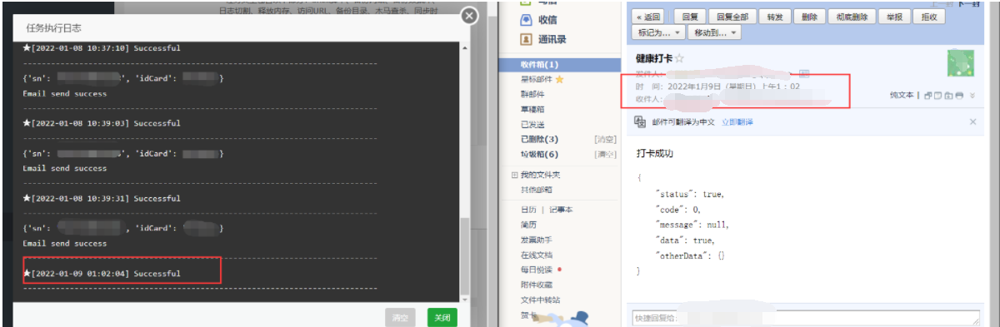

# 武汉理工大学健康打卡小脚本

**2022.5.1 更新**

> 前端时间，这个代码由于学校的后台更新，所以导致不能使用；同时由于自己前一段时间比较忙，在疯狂面试，然后还有其他的事情（主要是自己懒）所以代码一直没有更新；前几天发现已经有大佬把代码修复了，在看了大佬的代码后，绝！！！所以现在把大佬的代码整合进来，做个小更新吧!

---

**声明**：

- [**原始版本**]本 python 脚本是我在大佬的基础上修改的，大佬的链接如下：[haostart/Whut-Code - 码云 - 开源中国 (gitee.com)](https://gitee.com/haostart/whut-code?_from=gitee_search)
- [**新版本**]这是大佬修复后的原始代码地址 [ChrisKimZHT/WHUT-AutoHealthReport](https://github.com/ChrisKimZHT/WHUT-AutoHealthReport)

**使用方法：**

- 在`main.py`中输入您微信小程序登录的账号和密码，一般为**学号和身份证后六位**即可

- 如果需要邮箱提醒的功能，可以在`mail.py`中输入自己的**邮箱**

  

**注意事项**：在使用这个小脚本之前要先取消微信的绑定，否则会报错

**运行结果：**

**想法**：

- **如果想一劳永逸的话**，可以尝试买一台云服务器，让他每天定时启动，毕竟现在快双十一了嘛，价格也不贵！！😏😏😏
- 如果没有服务器，那可以使用一台不经常断电断网的电脑，每天定时运行就行了，windows 教程可以参考这个https://blog.csdn.net/Tangcutudou/article/details/118706448
- 如果不嫌麻烦的话，可以每天打开电脑运行这个`main.py`也行，哈哈哈！
- 由于现在要到考试周了，自己平时也没有时间，所以现在这个代码还十分简略，如果哪个大佬有更优的打卡方法可以在`issues`里交流哈，冲！！！！

**加载到服务器效果：**

备注：

- 使用的服务器为阿里云服务器，为了简化操作，使用了宝塔面板，然后设置了每天晚上执行的指令，实现效果见上图 👆👆👆

- 尽量不要选择在夜间打卡，夜间打卡学校的服务器可能有问题，可能会报 5005 的错误
