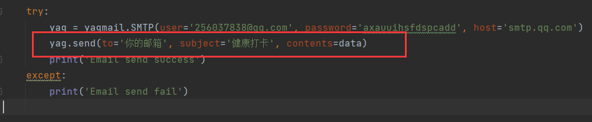
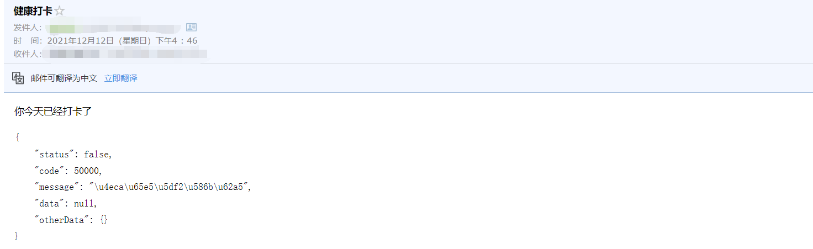

# 武汉理工大学健康打卡小脚本

**声明**：本python脚本是我在大佬的基础上修改的，大佬的链接如下：[haostart/Whut-Code - 码云 - 开源中国 (gitee.com)](https://gitee.com/haostart/whut-code?_from=gitee_search)

**使用方法：**

- 在`main.py`中输入您微信小程序登录的账号和密码，一般为**学号和身份证后六位**即可

  

- 如果需要邮箱提醒的功能，可以在`mail.py`中输入自己的**邮箱**

  

**注意事项**：在使用这个小脚本之前要先取消微信的绑定，否则会报错

**运行结果：**

**想法**：

- **如果想一劳永逸的话**，可以尝试买一台云服务器，让他每天定时启动，毕竟现在快双十一了嘛，价格也不贵！！
- 如果没有服务器，那可以使用一台不经常断电断网的电脑，每天定时运行就行了，windows教程可以参考这个https://blog.csdn.net/Tangcutudou/article/details/118706448
- 如果不嫌麻烦的话，可以每天打开电脑运行这个`main.py`也行，哈哈哈！
- 由于现在要到考试周了，自己平时也没有时间，所以现在这个代码还十分简略，如果哪个大佬有更优的打卡方法可以在`issues`里交流哈，冲！！！！
