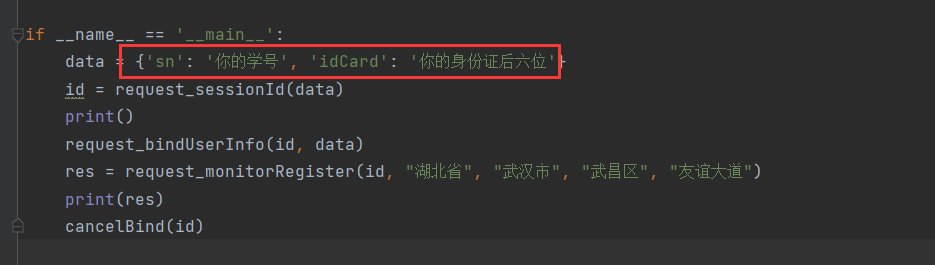

# 武汉理工大学健康打卡小脚本

**声明**：本python脚本是我在大佬的基础上修改的，大佬的链接如下：[haostart/Whut-Code - 码云 - 开源中国 (gitee.com)](https://gitee.com/haostart/whut-code?_from=gitee_search)

**使用方法：**

输入，学号和身份证后六位即可

**注意事项**：在使用这个小脚本之前要先取消微信的绑定，否则会报错

**想法**：如果想一劳永逸的话，可以尝试买一台云服务器，让他每天定时启动，毕竟现在快双十一了嘛，价格也不贵！！

